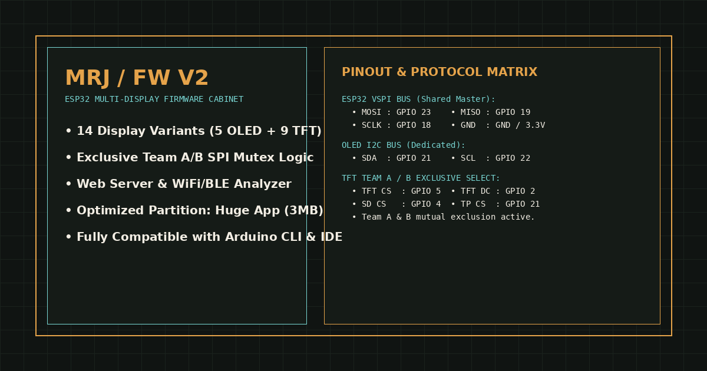

<div align="center">

# MRJ FW V2 — ESP32 Multi-Display Firmware Cabinet

[](https://mrjfw-hub-4hzt3cqe.manus.space)
[](https://github.com/espressif/arduino-esp32)
[](LICENSE)
[-success?style=for-the-badge)]()

*Firmware modular tingkat lanjut untuk ESP32 yang mendukung 14 varian display (OLED & TFT), manajemen eksklusif Tim A/B, Web Server built-in, serta analisis BLE/WiFi.*

[Website Resmi & Katalog BIN](https://mrjfw-hub-4hzt3cqe.manus.space)

</div>

---



---

## 📋 Daftar Isi
1. [Tentang Proyek](#tentang-proyek)
2. [Fitur Utama](#fitur-utama)
3. [Daftar 14 Varian Firmware](#daftar-14-varian-firmware)
4. [Katalog Varian OLED (Family A)](#katalog-varian-oled-family-a)
5. [Katalog Varian TFT & Aturan Tim A/B (Family B)](#katalog-varian-tft--aturan-tim-ab-family-b)
6. [Pinout & Skema Kabel ESP32](#pinout--skema-kabel-esp32)
7. [Library yang Diperlukan](#library-yang-diperlukan)
8. [Panduan Flashing (`esptool.py`)](#panduan-flashing-esptoolpy)
9. [Badges & Footer](#badges--footer)

---

## 🚀 Tentang Proyek

**MRJ FW V2** adalah penyempurnaan dari firmware modular ESP32 yang dirancang khusus untuk para *maker*, teknisi, dan *embedded developer* di meja kerja. Proyek ini memuat **14 varian firmware** siap kompilasi dan siap *flash* (.bin), terbagi atas **5 varian display OLED** berbasis I²C dan **9 varian display TFT** berbasis SPI.

Seluruh kode telah dioptimalkan untuk menggunakan partisi *Huge App* (3MB) agar muat menampung modul Web Server asinkron, manajemen EEPROM, buzzer PWM, serta analisis Bluetooth/Wi-Fi tanpa kendala memori.

---

## ✨ Fitur Utama

- **14 Varian Display Terpetakan:** Dari OLED 0.96" hingga TFT 3.5" (termasuk varian baru TFT 1.77" ST7735 dan TFT_eSPI ILI9488).
- **Sistem Eksklusif Tim A/B (Mutex SPI):** Khusus pada varian TFT, jalur SPI bersama (VSPI) dikelola secara ketat dengan sistem Tim A/B agar tidak terjadi konflik data antar modul.
- **Async Web Server:** Memungkinkan pengaturan dan pemantauan perangkat langsung via browser di jaringan lokal.
- **BLE & Wi-Fi Analyzer:** Fitur pemindaian perangkat nirkabel langsung dari mikrokontroler.
- **BadUSB & GPIO Control:** Modul kendali periferal untuk pengujian sistem tertanam.

---

## 📦 Daftar 14 Varian Firmware

| No | Nama Varian | Kategori | Driver | Resolusi | Antarmuka | Status Mutex |
|----|-------------|----------|--------|----------|-----------|--------------|
| 1 | `OLED_096_SSD1306_128x64` | OLED | SSD1306 | 128×64 | I²C | Bebas |
| 2 | `OLED_13_SSD1306_128x64` | OLED | SSD1306 | 128×64 | I²C | Bebas |
| 3 | `OLED_15_SH1106_128x64` | OLED | SH1106 | 128×64 | I²C | Bebas |
| 4 | `OLED_20_SSD1306_128x64` | OLED | SSD1306 | 128×64 | I²C | Bebas |
| 5 | `OLED_242_SH1106_128x64` | OLED | SH1106 | 128×64 | I²C | Bebas |
| 6 | `TFT_13_ST7789_240x240` | TFT | ST7789 | 240×240 | SPI | Tim A/B |
| 7 | `TFT_154_ST7789_240x240` | TFT | ST7789 | 240×240 | SPI | Tim A/B |
| 8 | `TFT_177_ST7735_128x160` | TFT | ST7735 / ST7735S | 128×160 | SPI | Tim A/B |
| 9 | `TFT_18_ST7735_128x160` | TFT | ST7735 | 128×160 | SPI | Tim A/B |
| 10 | `TFT_20_ST7789_240x320` | TFT | ST7789 | 240×320 | SPI | Tim A/B |
| 11 | `TFT_24_ILI9341_240x320` | TFT | ILI9341 | 240×320 | SPI | Tim A/B |
| 12 | `TFT_24_ST7789_240x320` | TFT | ST7789 | 240×320 | SPI | Tim A/B |
| 13 | `TFT_28_ILI9341_240x320` | TFT | ILI9341 | 240×320 | SPI | Tim A/B |
| 14 | `TFT_35_ILI9488_TFT_eSPI` | TFT | ILI9488 / TFT_eSPI | 320×480 | SPI | Tim A/B |

---

## 🔌 Pinout & Skema Kabel ESP32

### 1. Bus I²C (Khusus Varian OLED)
| Pin ESP32 | Pin OLED | Keterangan |
|-----------|----------|------------|
| **GPIO 21** | SDA | Serial Data |
| **GPIO 22** | SCL | Serial Clock |
| **3V3** | VCC | Daya 3.3V |
| **GND** | GND | Ground |

### 2. Bus VSPI / SPI (Khusus Varian TFT & Aturan Tim A/B)
| Pin ESP32 | Pin TFT / Periferal SPI | Keterangan |
|-----------|--------------------------|------------|
| **GPIO 23** | MOSI (SDA) | Master Out Slave In |
| **GPIO 19** | MISO | Master In Slave Out (opsional untuk SD Card) |
| **GPIO 18** | SCLK (SCK) | Serial Clock |
| **GPIO 5** | TFT_CS | Chip Select Display |
| **GPIO 2** | TFT_DC (RS) | Data / Command Control |
| **GPIO 4** | SD_CS | Chip Select SD Card (jika ada) |
| **GPIO 21** | TP_CS | Touch Panel Chip Select (pada layar sentuh) |
| **EN / RST** | RESET | Reset Display |

> **Catatan Aturan Tim A/B pada TFT:** Dua kelompok modul memakai jalur SPI bersama. Sistem Tim A/B menjaga dua modul tetap eksklusif: saat satu grup aktif (Team A), grup satunya berada dalam kondisi non-aktif (Team B). OLED tidak memerlukan mekanisme ini.

---

## 📚 Library yang Diperlukan

Untuk melakukan kompilasi manual melalui Arduino IDE atau Arduino CLI, pastikan library berikut sudah terinstal:
1. `Adafruit GFX Library` (v1.11+)
2. `Adafruit SSD1306` (untuk varian OLED SSD1306)
3. `Adafruit SH110X` (untuk varian OLED SH1106)
4. `Adafruit ST7735 and ST7789 Library` (untuk varian TFT ST7735 & ST7789)
5. `Adafruit ILI9341` (untuk varian TFT ILI9341)
6. `TFT_eSPI` oleh Bodmer (khusus varian TFT 3.5" ILI9488)
7. `ESPAsyncWebServer` & `AsyncTCP` (untuk server web asinkron)
8. `ArduinoJson` (v6.x)

---

## ⚡ Panduan Flashing (`esptool.py`)

Gunakan perintah berikut untuk mem-flash file `.bin` ke ESP32 Anda melalui port serial:

```bash
esptool.py --chip esp32 --port /dev/ttyUSB0 --baud 921600 write_flash 0x10000 nama_file_varian.bin
```
*(Ganti `/dev/ttyUSB0` dengan port serial perangkat Anda, misal `COM3` di Windows).*

---

## 🌐 Tautan Web & Sumber Daya

- **Website Resmi & Katalog Interaktif:** [https://mrjfw-hub-4hzt3cqe.manus.space](https://mrjfw-hub-4hzt3cqe.manus.space)
- **Dokumentasi & QA Visual:** Lihat folder proyek untuk laporan pengujian antarmuka.

---

## 🏷️ Badges & Footer

<div align="center">


*Dibuat dengan presisi untuk para pengembang perangkat keras.*  
*(c) 2026 MRJ Embedded Systems & Manus AI.*

</div>
